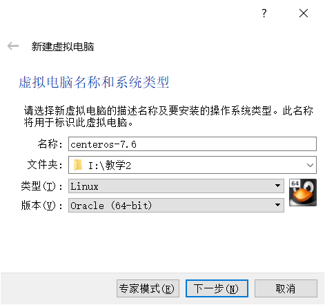
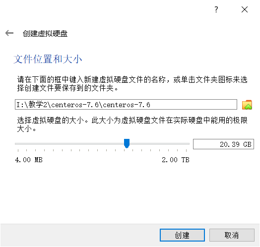
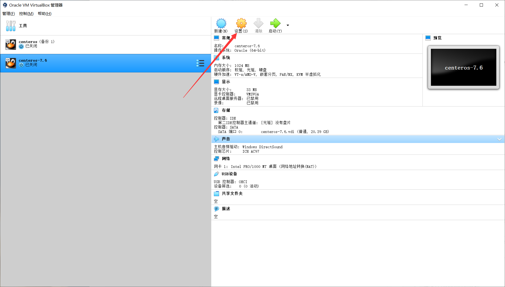
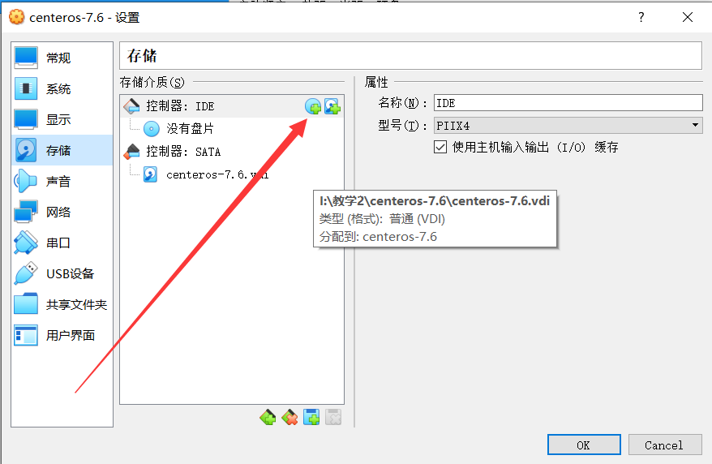
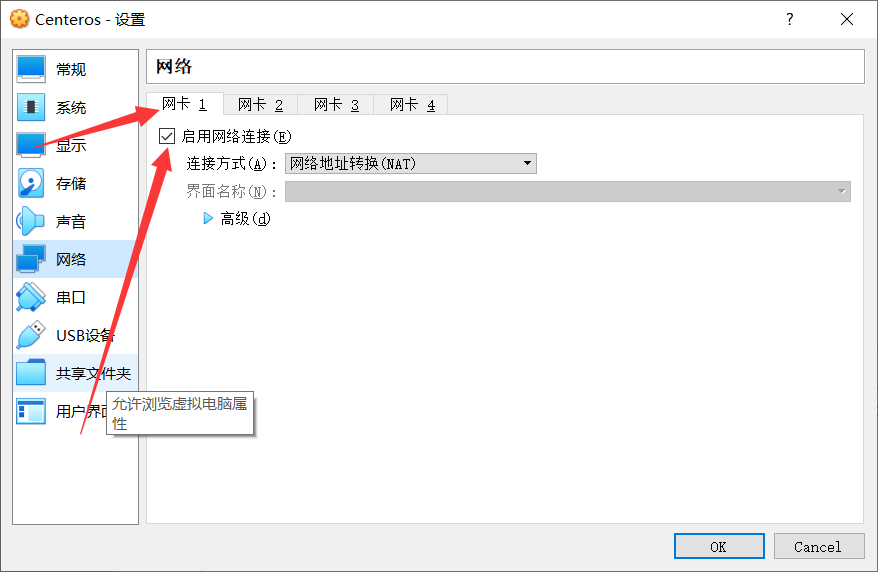
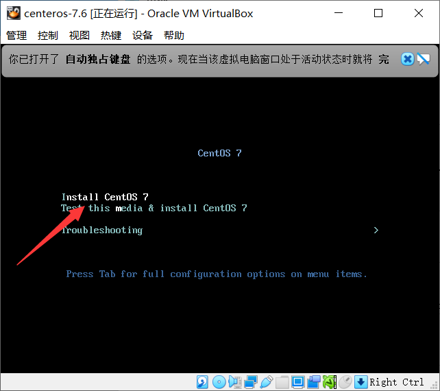
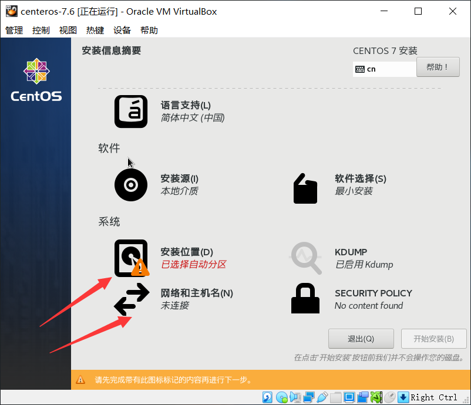
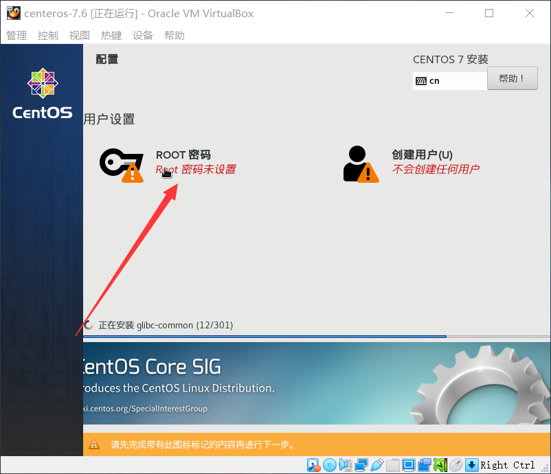
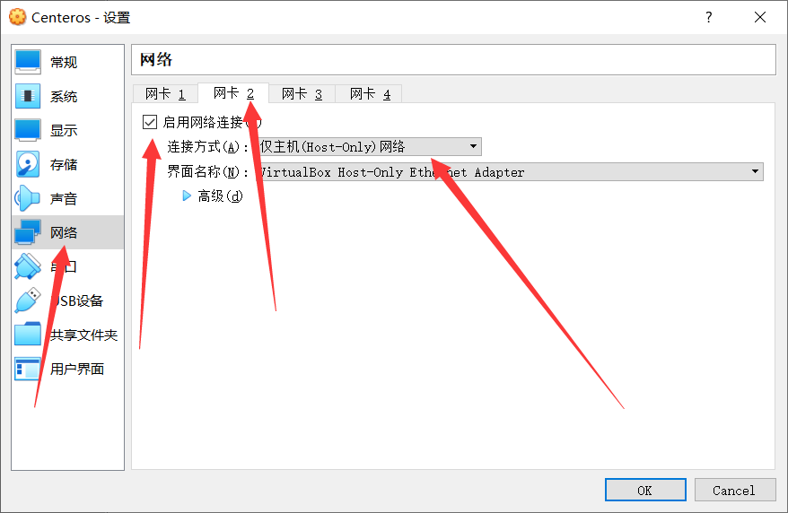

# 高职组软件测试赛题库(环境部署)

> Author: Li-Soul  
> Time: 2021-04-30

## 一. 任务概述
> 本部分按照环境搭建及系统部署要求文档，完成CentOS、JDK、MySQL、Tomcat等测试环境搭建与配置，并安装与部署应用系统，并最终能通过浏览器成功访问系统，过程与结果需截图。截图需粘贴在环境搭建及系统部署报告中。

## 二. 题目要求

> 个人使用最新版的VirtualBox6.1.22, CenterOS7, Openjdk16.0.1, mysql8.0.24, Tomcat10.0.5
> 文件下载:

- Linux知识普及
> ssh连接: `ssh root@(虚拟机ip地址)`  
> - 样例
> ```
> ssh root@192.168.0.2
> ```
> scp文件传输: `scp (本地文件地址) root@(虚拟机ip地址):(虚拟机文件位置)`  
> - 样例
> ```
> scp openjdk.tar.gz root@192.168.0.2:~/
> ```

- #### 题目

##### 1. 安装CentOS 7
> 使用VirtualBox和提供的ISO文件安装CentOS 7，安装成功后，使用命令行界面操作系统。
- 截图要求：一共2张图：①安装过程中，设置root账号密码界面截图；②安装成功后，root账号登录系统截图。
---
- ###### 部署过程
1. 新建虚拟机
根据图片配置虚拟机



- 根据下图添加本地文件夹中的ios镜像文件

- 设置网卡1

- 选择箭头所指

- 磁盘配置以及网络设置

- 设置root密码

- 安装完之后重启并设置网卡2

- 开机查看IP地址
```
ip a
```

> 设置
2. 检查网络连接
打开主机CMD检查与虚拟机的连通
```
ping (虚拟机ip地址)
```
3. SSH连接虚拟机
在主电脑CMD输入
```
ssh root@(虚拟机ip)
```


##### 2. 安装配置JDK
> 在CentOS系统中，使用提供的JDK安装包，安装JDK。
- 截图要求：一共2张图，分别为：①截取JDK环境变量配置截图；②JDK安装成功后，截取使用命令查看JDK版本信息截图。
---
- ###### 部署过程
> 1. 传输文件到CenterOS系统
> ```
> scp openjdk-16.0.1_linux-x64_bin.tar.gz root@192.168.56.103:~/
> ```
> 2. 解压文件
> ```
> tar -zxvf openjdk-16.0.1_linux-x64_bin.tar.gz
> ```
> 3. 移动文件
> ```
> mv jdk-16.0.1 /usr/local/jdk-16.0.1
> ```
> 4. 添加环境变量
> ```
> vi /etc/profile
> ```
> 在文件末尾写入
> ```
> # openjdk16.0.1
> export JAVA_HOME=/usr/local/jdk-16.0.1
> export JRE_HOME=${JAVA_HOME}
> export CLASSPATH=.:${JAVA_PATH}/lib:${JAVA_HOME}/lib
> export PATH=${JAVA_HOME}/bin:$PATH
> ```
> 按`:wq`保存退出
> - 激活环境变量使配置生效
> ```
> source /etc/profile
> ```
> 5. 检查环境是否部署成功
> ```
> java -version
> ```


##### 3. 安装配置MySQL
> 在CentOS系统中，使用提供的MySQL安装包，安装MySQL。
- 截图要求：一共3张图：①截取MySQL配置文件截图；②截取root账号成功登录MySQL截图；③截取使用suthr.sql初始化人力资源综合服务系统数据库命令截图。
---
- ###### 部署过程
> 1. 传输文件到CenterOS系统
> - 卸载Centeros7自带Mariadb
> ```
> rpm -qa|grep mariadb
> rpm -e --nodeps mariadb-libs-5.5.68-1.el7.x86_64
> ```
> ```
> scp mysql-8.0.24-linux-glibc2.12-x86_64.tar.xz root@192.168.56.103:~/
> ```
> 2. 解压文件
> ```
> tar -xvf mysql-8.0.24-linux-glibc2.12-x86_64.tar.xz
> ```
> 3. 移动文件
> ```
> mv mysql-8.0.24-linux-glibc2.12-x86_64 /usr/local/mysql
> ```
> 4. 创建mysql用户
> ```
> groupadd mysql
> useradd -g mysql mysql
> ```
> 5. 更改目录权限
> ```
> chown -R mysql:mysql /usr/local/mysql
> chmod -R 777 /usr/local/mysql
> ```
> 6. 初始化mysql
> 切换到mysql的bin目录下
> ```
> cd /usr/local/mysql/bin
> ```
> 执行mysql初始化命令
> ```
> ./mysqld --initialize
> ```
> 7. 设置环境变量
> ```
> vi /etc/profile
> ```
> 在文件末尾写入
> ```
> # mysql8.0.24
> export MYSQL_HOME=/usr/local/mysql/bin
> export PATH=$PATH:$MYSQL_HOME 
> ```
> 按`:wq`保存退出
> - 激活环境变量使配置生效
> ```
> source /etc/profile
> ```
> 8. 添加开机自启动
> ```
> ln -s /usr/local/mysql/support-files/mysql.server /etc/init.d/mysql
> ln -s /usr/local/mysql/bin/mysql /usr/bin/mysql
> ```
> 9. 启动mysql服务
> ```
> service mysql start
> ```
> 10. 登陆mysql
> ```
> mysql -u root -p
> ```
> 11. 修改密码
> ```
> ALTER USER "root"@"localhost" IDENTIFIED BY "password";
> FLUSH PRIVILEGES;
> ```
> 12. 修改公网访问
> ```
> use mysql;
> update user set host='%' where user='root';
> FLUSH PRIVILEGES;
> ```
> 13. 设置防火墙
> ```
> # 检查是否有或者是否开启firewall
> systemctl status firewalld
> # 开启防火墙
> systemctl start firewalld
> # 设置开机自启
> systemctl enable firewalld
> # 设置3306为永久开发
> firewall-cmd --add-port=3306/tcp --permanent
> # 重启生效
> firewall-cmd --reload
> ```

##### 4. 安装配置Tomcat
> 在CentOS系统中，使用提供的Tomcat安装包，安装Tomcat。
- 截图要求：一共2张图：①Tomcat安装成功后，截取启动Tomcat服务命令截图；②Tomcat安装成功后，截取通过浏览器访问Tomcat主页截图。
---
- ###### 部署过程
> 1. 传输文件到CenterOS系统
> ```
> scp apache-tomcat-10.0.5.tar.gz root@192.168.56.103:~/
> ```
> 2. 解压文件
> ```
> tar -zxvf apache-tomcat-10.0.5.tar.gz
> ```
> 3. 移动文件
> ```
> mv apache-tomcat-10.0.5/ /usr/local/tomcat
> ```
> 4. 执行Tomcat脚本启动tomcat
> ```
> /usr/local/tomcat/bin/startup.sh
> ```
> 5. 查看Tomcat监听的端口
> ```
> netstat -ltnp |grep java
> ```
> 6. 关闭防火墙
> ```
> systemctl stop firewalld.service
> ```
> - 网页访问虚拟机ip查看tomcat服务

##### 5. 系统应用部署
> 将suthr.war包部署到Tomcat。
- 截图要求：一共2张图，分别为：①项目部署成功后，截取webapps目录截图；②项目部署成功后，截取通过浏览器访问人力资源综合服务系统登录页截图。
---
- ###### 部署过程


## 三. 技术参数选取范围
> 无